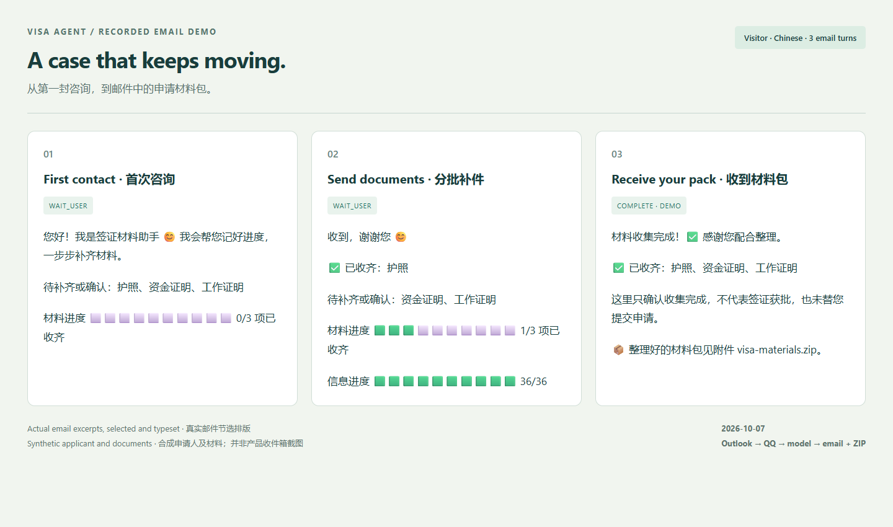
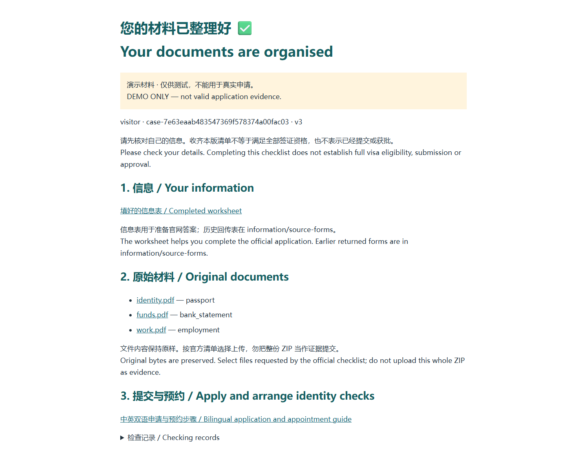
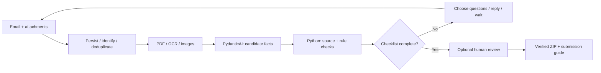

<p align="center"></p>
<h1 align="center">Visa Agent</h1>
<p align="center"><strong>From the first email to an organised application pack.</strong></p>
<p align="center">A UK visa document assistant that remembers the case, asks what is missing, and replies where the customer already is.</p>
<p align="center"><a href="#see-it-work">Demo</a> · <a href="#try-it">Try it</a> · <a href="docs/deployment.md">Deploy</a> · <a href="TESTING.md">Tests</a> · <a href="README.zh-CN.md">简体中文</a></p>
<p align="center"><a href="LICENSE"></a> <a href="https://github.com/Sanssssssssssssssss/Visa-Agent/actions/workflows/ci.yml"></a>  </p>

## See it work



*An excerpt rendered from [actual email transcripts](docs/full-delivery-transcripts.md), not a product inbox screenshot. Visitor and Student were tested in Chinese; Skilled Worker in English. All applicants and application documents were synthetic.*

> “你好，我想去英国旅游，第一次办签证，不知道从哪里开始。”

The customer sends an email, fills a bilingual worksheet, and replies with attachments. The agent tracks missing items and contradictions, asks up to three next questions, and sends a ZIP when the current checklist is complete. Its final reply explains how to continue on GOV.UK and follow the official identity-check or appointment flow.

- **Continue the same case.** Sender, mailbox, thread and message IDs bind each conversation. Repeated deliveries are deduplicated; `/reset` starts a fresh case.
- **Read the actual files.** PDFs become page images when needed; OCR text and images feed structured extraction with page references.
- **Make progress visible.** Chinese or English replies, emoji progress, and a bilingual information worksheet.
- **Deliver something inspectable.** Originals, completed worksheet, a bilingual guide, provenance, checks and a manifest in one ZIP.



Download recorded demo packs: [Visitor](examples/packs/visitor-demo.zip) · [Student](examples/packs/student-demo.zip) · [Skilled Worker](examples/packs/skilled_worker-demo.zip). Unzip and open `START-HERE.html`. [The delivery report](docs/full-delivery.md) records nine real customer emails and byte-for-byte checks of three ZIPs downloaded from Outlook.

## Try it

Install [uv](https://docs.astral.sh/uv/getting-started/installation/). It creates a project-local Python 3.12 environment from the lockfile.

```sh
git clone https://github.com/Sanssssssssssssssss/Visa-Agent.git
cd Visa-Agent
uv sync --locked --python 3.12
uv run visa-agent --mode offline verify-dataset
uv run visa-agent --mode offline replay datasets/cases/dev_visitor.json --approve-demo
```

The replay prints its case ID and ZIP path. Expected final status: `COMPLETE`, with a synthetic adviser record. This offline model reads fixture labels; it tests the workflow, not live model understanding.

### Test through your own email

Use a dedicated QQ/Foxmail inbox for the agent. Customers can send from Outlook, Gmail or another mailbox; they need no Microsoft application registration or project UI.

1. Configure the model and QQ authorization code using the [deployment guide](docs/deployment.md).
2. Run `uv run python scripts/mail_service.py start`. The worker stays in the background while the computer is awake.
3. Send a new email to **your configured agent address**, then reply in the same thread. [Exact messages, attachment paths and negative cases](docs/channels/email.md).

For sample testing: `uv run python -m visa_agent.qq_mail samples --allow-samples on`, then start a new thread or send `/reset`. Windows also has [on](scripts/sample-debug-on.cmd), [off](scripts/sample-debug-off.cmd), [start](scripts/mail-start.cmd), [status](scripts/mail-status.cmd) and [stop](scripts/mail-stop.cmd) buttons. Messages cannot enable sample mode. Missing information, conflicts and unreadable files still block completion.

## Agent and workflow

Customer replies are written by the model, including the final handover. Configuration loads from [.env.example](.env.example) copied to `.env`. [Latest conversation and failure-recovery tests](docs/conversation-repair.md).



**Why a small harness?** This task needs a durable case more than an agent running continuously. PydanticAI handles semantic interpretation, tools and model-written customer replies; Python owns evidence checks and transitions; SQLite retains the case, inbox and outbox. Waiting for a customer costs no model requests.

**How is delivery kept stable?** Extracted facts need sources; unknown checks cannot pass; conflicts remain visible; the model cannot approve a case. Each event shares a four-request budget and bounded retries. Context is rebuilt from the case plus up to 20 recent turns. Sending checks the current version; failed or ambiguous sends are retried from the persistent outbox; SMTP can deliver duplicates. [Architecture and tradeoffs](docs/architecture.md) · [Function walkthrough (中文)](docs/implementation.md).

## Coverage and limits

| Capability | Current evidence |
|---|---|
| Three visa routes | Complete synthetic cases through real QQ mail and model APIs |
| QQ/Foxmail | Live receive, threaded replies, attachments and ZIP download verified |
| Outlook Graph | Adapter and offline tests; live OAuth/Graph not verified |
| WhatsApp | Conversation simulator and isolation tests; [Chatwoot integration guide](docs/channels/whatsapp.md), no deployed provider bridge |
| Bad materials | Self-written field lists, screenshots, unreadable files, samples in normal mode |
| Multiple senders and persistence | Offline interleaved conversations, restart, duplicates, stale approvals and context tests |

This MVP covers limited adult applicants outside the UK. It does not authenticate documents, establish complete eligibility, submit applications or book appointments. Visitor automation covers the employed/self-funded branch; Student automated finance checks use GBP/own funds; Skilled Worker occupation automation is limited to 2134, without full salary or sponsor eligibility checks. Rules are versioned snapshots, not a live legal feed.

Sample packs are labelled. With HITL off, `COMPLETE` means the implemented collection checklist passed without human approval. SQLite currently serializes processing, including model calls; this is a small pilot with no production throughput claim. [Tests and recorded failures](TESTING.md).

## Repository

| Path | Purpose |
|---|---|
| [src/visa_agent/](src/visa_agent/) | Case engine, model calls, readers, rules, channels and delivery |
| [tests/](tests/) | Offline regression, adversarial and persistence tests |
| [datasets/](datasets/) | Frozen cases, synthetic documents, images and information forms |
| [examples/](examples/) | Downloadable packs and deployment configuration |
| [scripts/](scripts/) | Setup, background worker controls, fixtures and acceptance runners |
| [docs/](docs/README.md) | Deployment, architecture, receipts, sources and historical experiments |

```sh
uv run ruff check src tests scripts
uv run pytest -q
```

CI runs offline. Keys, customer files, raw mail and full local traces stay outside Git. See [CONTRIBUTING](CONTRIBUTING.md), [SECURITY](SECURITY.md) and [third-party notices](THIRD_PARTY_NOTICES.md). Code is [MIT](LICENSE); reference material keeps its original rights.
