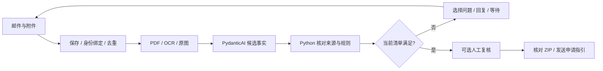

<p align="center"></p>
<h1 align="center">Visa Agent</h1>
<p align="center"><strong>从第一封咨询邮件，到整理好的申请材料包。</strong></p>
<p align="center">记住案件进度，一步步询问信息、收集材料，直接在客户的邮箱里继续办理。</p>
<p align="center"><a href="#演示">演示</a> · <a href="#开始使用">开始使用</a> · <a href="docs/deployment.zh-CN.md">部署</a> · <a href="TESTING.md">测试</a> · <a href="README.md">English</a></p>
<p align="center"><a href="LICENSE"></a> <a href="https://github.com/Sanssssssssssssssss/Visa-Agent/actions/workflows/ci.yml"></a>  </p>

## 演示


*图片从[实际邮件原文](docs/full-delivery-transcripts.md)节选排版，并非产品收件箱截图。Visitor、Student 用中文测试，Skilled Worker 用英文测试；申请人和申请材料均为合成样例。*

> “你好，我想去英国旅游，第一次办签证，不知道从哪里开始。”

客户发邮件咨询，填写中英双语信息表，随后在原线程回复附件。Agent 保存已知情况，发现缺项和冲突，每轮选择最多三个下一步问题。当前清单满足后，邮件附上 ZIP，并说明如何从 GOV.UK 继续填写、提交申请和按官方提示完成身份核验或预约。

- **能持续跟进。** 邮箱、发件人、线程和消息 ID 绑定会话；重复投递去重，`/reset` 开新案。
- **能读取材料。** PDF 按需转图片，OCR 和原图用于提取；每个候选字段保留文件、页码和原文。
- **能看懂进度。** 跟随中文或英文回复，emoji 显示材料进度，信息表同时提供两种语言。
- **能拿到结果。** ZIP 包含原文件、已填写的信息表、双语申请指引、字段来源和检查清单。


下载：[Visitor](examples/packs/visitor-demo.zip) · [Student](examples/packs/student-demo.zip) · [Skilled Worker](examples/packs/skilled_worker-demo.zip)。解压后打开 `START-HERE.html`。[验收记录](docs/full-delivery.md)包含三条路线共九轮真实邮件，以及在 Outlook 下载 ZIP 后的逐字节核对。

## 开始使用

安装 [uv](https://docs.astral.sh/uv/getting-started/installation/)。Python 3.12 和依赖安装到本项目环境，版本锁定在 `uv.lock`。

```sh
git clone https://github.com/Sanssssssssssssssss/Visa-Agent.git
cd Visa-Agent
uv sync --locked --python 3.12
uv run visa-agent --mode offline verify-dataset
uv run visa-agent --mode offline replay datasets/cases/dev_visitor.json --approve-demo
```

回放输出案件 ID 和 ZIP 路径。预期最终为 `COMPLETE`，审批记录标注模拟顾问。离线模型读取样例中的字段标签，用于验证流程，不能证明真实模型理解能力。

### 用自己的邮箱测试

为 Agent 准备独立 QQ/Foxmail 邮箱。客户可以从 Outlook、Gmail 或其他邮箱发信，不需要注册微软应用，也不需要打开项目页面。

1. 按[部署指南](docs/deployment.zh-CN.md)配置模型环境和 QQ 授权码。
2. 执行 `uv run python scripts/mail_service.py start`，收件进程在后台运行。
3. 给**自己配置的 Agent 邮箱**发新邮件，再在同一线程回复。[可复制正文、样例路径和反例步骤](docs/channels/email.zh-CN.md)。

样例调试：执行 `uv run python -m visa_agent.qq_mail samples --allow-samples on`，之后发新邮件或先发 `/reset`。Windows 可双击[开启样例](scripts/sample-debug-on.cmd)、[关闭样例](scripts/sample-debug-off.cmd)、[启动](scripts/mail-start.cmd)、[状态](scripts/mail-status.cmd)、[停止](scripts/mail-stop.cmd)。客户消息不能修改模式；缺项、冲突和不可读文件仍会阻止完成。

## Agent 与 workflow



**为什么这样选框架？** 业务更需要持久化案件和明确停止点。PydanticAI 负责结构化调用，Python 函数负责材料判断和状态变更，SQLite 保存案件、收件和发件记录。等待客户时不调用模型。

**怎么保证交付稳定性？** 提取值必须有来源；未知检查不能通过；冲突保留双方证据；模型没有批准工具。每事件共用四次请求预算和有限重试。上下文从 Case 和最近最多 20 轮重建。发送前核对当前版本；SMTP 结果不明时记录待查，避免盲目重发。[架构与取舍](docs/architecture.zh-CN.md) · [按函数阅读实现](docs/implementation.md)。

## 已验证范围

| 能力 | 当前证据 |
|---|---|
| 三条签证路线收集 | 合成案例通过真实 QQ 邮件和模型走到交付 |
| QQ/Foxmail | 已验证真实收件、线程回复、附件和 ZIP 下载 |
| Outlook Graph | 有适配器和离线测试；未验证真实 OAuth/Graph 收发 |
| WhatsApp | 有会话模拟和隔离测试；[Chatwoot 接入说明](docs/channels/whatsapp.zh-CN.md)，尚无已部署的渠道桥接 |
| 材料误收反例 | 自写字段清单、截图、不可读文件、正常模式下的样例 |
| 持久化与多客户 | 离线交错会话、重启、重复消息、旧审批、上下文压缩测试 |

MVP 只覆盖成年主申请人在英国境外的有限分支。不鉴定真伪、不核验完整资格、不替客户投递或预约。Visitor 自动分支为在职自费；Student 自动资金检查限 GBP/自有资金；Skilled Worker 职业自动分支限 2134，未实现完整薪资与雇主资格核验。规则有版本和核对日期，运行时不会自动更新法规。

样例模式产出演示标记的材料包。HITL 关闭时，`COMPLETE` 表示本版收集清单满足，未经人工批准。SQLite 连同模型调用串行处理，适合小规模试用；目前没有生产吞吐量结论。[测试索引与保留的失败](TESTING.md)。

## 仓库结构

| 路径 | 作用 |
|---|---|
| [src/visa_agent/](src/visa_agent/) | 案件引擎、模型、读取器、规则、渠道和材料包 |
| [tests/](tests/) | 离线回归、反例与持久化测试 |
| [datasets/](datasets/) | 冻结场景、合成文件、图片和信息表 |
| [examples/](examples/) | 可下载材料包与部署配置样例 |
| [scripts/](scripts/) | 配置、后台启停、材料生成和验收脚本 |
| [docs/](docs/README.md) | 部署、架构、验收、来源与历史实验 |

```sh
uv run ruff check src tests scripts
uv run pytest -q
```

CI 默认只跑离线检查。密钥、客户文件、原始邮件和完整本机 trace 不提交 Git。贡献见 [CONTRIBUTING](CONTRIBUTING.md)，安全边界见 [SECURITY](SECURITY.md)，复用说明见[第三方声明](THIRD_PARTY_NOTICES.md)。代码采用 [MIT](LICENSE)，第三方参考资料保留原版权。
