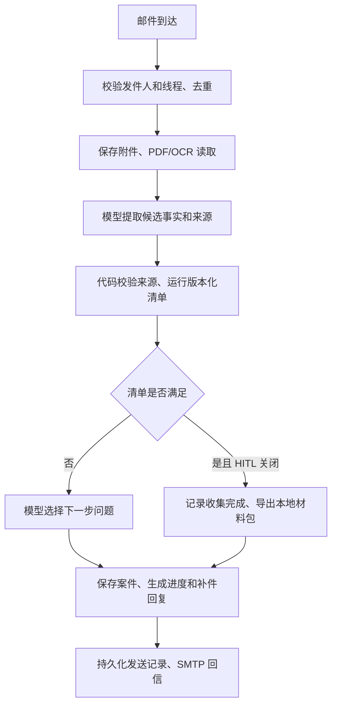

# 邮件材料收集：体验与稳定性

当前 QQ 邮箱使用 `--hitl off`。客户发邮件即可建案、补件、查看进度；当前清单满足后，系统通知“材料收集完成”。没有人工材料包批准步骤，也不需要模型再批准一次。自动完成记录绑定案件版本、证据清单哈希和运行 ID，`basis=checklist`；历史记录保留原来的决策来源。

完成表示有限 SOP 下的材料与信息已收齐。系统仍检查缺项、读取质量、字段来源和已实现的一致性/日期条件；不鉴定真伪，不判断签证一定获批，不代替客户提交申请。ZIP 保存在本机，邮件当前发送收集结果，不附带 ZIP。

## 客户每轮看到什么

`conversation.reply_for()` 按实际状态生成短邮件：收到的文件名 → 已了解的信息 → 已收齐/待补齐的材料类别 → 下一步问题 → 进度。用少量 emoji 帮助阅读；通常问一至两项，最多三项。客户询问流程时才解释申请步骤，询问材料时附对应官方链接。第一次简短提醒使用真实材料，涉及伪造时才展开风险说明。

“已收到”只代表接收成功；样例、无关文件或读取问题会另行说明。文件类别都满足但申请信息还不全时，不显示全满进度条。收到更改后重新计算当前版本，旧的完成记录失效。

[SOUL.md](../../src/visa_agent/prompts/SOUL.md) 放在提取和引导两个阶段的系统指令前。模型决定下一步问题的优先级，代码输出有依据的进度和完成结论。固定问候、材料标签在 `conversation.py`；仅改 SOUL 不会改写所有固定措辞。

## Agent 与 workflow 的选择

采用一个案件服务、两个有明确职责的模型阶段：

`service.handle_event()` 负责顺序和事务；`agent.extract()` 负责自然语言/材料提取；`guidance.guide()` 只能从未解决项目中选问题。收集已完成时跳过引导模型。`Evidence` 与 `rules.evaluate()` 决定哪些事实可用于检查，`reply_for()` 不接受模型自称“已完成”作为依据。

PydanticAI 提供类型化输出、验证器和调用预算，SQLite 管持久化状态，标准库处理 IMAP/SMTP/MIME。当前单邮箱 MVP 不需要增加 LangGraph、Camunda 或多 Agent：阶段固定、外部事件触发、每轮结束后等待客户，模型没有无限规划循环。PydanticAI 不是持久化工作流引擎，恢复、版本和发信去重由应用负责。

## 如何处理业务不确定性

| 不确定性 | 当前处理 | 客户看到什么 |
|---|---|---|
| 缺申请地点、日期或适用条件 | 保留 `unknown`，只问尚未确认的信息 | 下一步补充具体问题 |
| 首次日期没年份、居住地被推成申请地 | 不保存推测值，保存未确认原因 | 询问完整日期或申请地点 |
| 文件看不清、页码问题、样例 | 不计为可用证据，保留原始附件与诊断 | 文件名、问题、所需材料 |
| 姓名/资金等冲突 | 保留两边来源，禁止后写覆盖 | 指出不一致，暂不确认完成 |
| 未实现的国籍/身份/家属等分支 | HITL 关闭时停在 `BLOCKED` | 说明范围限制，不虚构已转人工 |
| 模型、网络、落盘失败 | 保留失败；收集状态不能为完成 | 可发送的处理失败说明；发信自身失败另记 |
| 政策变动 | 固定规则版本，变更后重新校验 | 旧完成结论不能继续使用 |

不确定性应成为可记录、可解释的状态。提示词能改善提取，却不能证明语义正确：来源中找得到一句话也不等于模型理解一定正确。当前还不能自动裁定冲突、撤销旧坏文件或修复所有失败事件；这些情况可能需要操作者处置或用 `/reset` 开新案件重新提交正确材料，不能承诺反复补件一定自愈。

## 如何保证交付稳定性

| 层次 | 已实现的约束 | 验证方法 |
|---|---|---|
| 输入 | 邮箱账户、发件人、线程隔离；事件唯一键；附件哈希与大小/页数限制 | 多发件人、重复投递、线程冒用、坏附件测试 |
| 模型 | 结构化字段、原文引用、只读本案工具；每事件最多四请求，含重试 | 错参数、诱导文本、无来源字段、预算耗尽测试 |
| 业务 | 未知不算通过；必需信息齐备才完成；金额/日期由代码检查 | 三路线正向与缺项/冲突负面案例 |
| 状态 | 事务、案件版本、清单哈希；完成随材料变化失效 | 重启、旧审批、完成后更改、落盘失败测试 |
| 回复 | 从已校验状态组织清单与进度，模型只能选问题 | 不把接收当收齐；信息未齐不显示全满；失败不宣布完成 |
| 发信 | 持久化发送记录、旧版本回复拦截；发送结果不确定时不自动重发 | SMTP 歧义、重复轮询、真实邮箱回执 |

最近 20 轮完整对话进入工作上下文；较旧内容从结构化 Case 重建，同字段同值合并计数，冲突值分别保留。默认上限 32,000 字符，先缩减材料摘录，再移除较旧对话；关键状态仍放不下就停止。完整原文留在 SQLite，不用模型生成的摘要替换证据。这是工作集裁剪，不是无损保存所有历史到模型窗口。

等待客户时不调用模型。当前 SQLite 写事务包含本轮处理，适合低量串行测试；尚未证明高并发或持续数周运行。SMTP 接受也不等于客户已读，发送结果不确定时不能声称“恰好一次送达”。

## 参考与验收

核对日期：2026-10-07。参考设计，不把这些产品列为已集成运行时：

- [Intercom Fin Guidance](https://www.intercom.com/help/en/articles/10560969-fin-guidance-best-practices)：具体条件、简洁表达、分开设置沟通风格与业务要求。
- [Rasa collect/validation](https://rasa.com/docs/reference/primitives/flow-steps/)：已填写项无需重复问；字段校验独立于询问。还检查了 [Rasa SDK forms.py](https://github.com/RasaHQ/rasa-sdk/blob/main/rasa_sdk/forms.py) 的 `get_extraction_events`、`get_validation_events` 和 `next_requested_slot`，借鉴提取、校验、下一问题分工。
- [PydanticAI Agent](https://pydantic.dev/docs/ai/core-concepts/agent/)：结构化验证和 `UsageLimits`。SDK 能约束调用与形状，不能替业务定义“完成”。

本轮实际执行记录见 [collection-ux.json](../validation/collection-ux.json)。此前失败记录保留；合成材料、模拟并发和一次真实邮箱验收分别报告，不能合并成生产准确率。

复现离线检查：`.venv/Scripts/python.exe -m pytest -q`。真实中文合成材料闭环：`.venv/Scripts/python.exe -X utf8 scripts/hitl_acceptance.py run --spec datasets/hitl-outlook/focused.json --output output/collection-retest`，单独预算最多四次，不覆盖已有结果。
