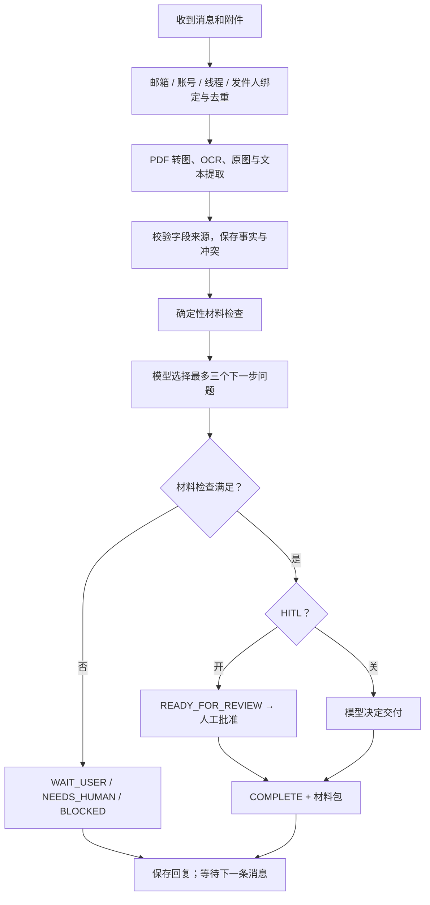

# 可选人工复核与 Outlook 测试

HITL 可在启动时选择：`--hitl on` 或 `--hitl off`，默认开启。设置保存在新案件中；切换启动参数后，用 `/reset` 或“一键清空”建立新案件。旧案件保留原审核方式。

```powershell
# 本地 UI：关闭人工复核，模型决定何时交付
uv run python -m visa_agent.web --hitl off --data data/manual-auto --port 8765
# 开启人工复核，使用独立数据目录
uv run python -m visa_agent.web --hitl on --data data/manual-review --port 8766
```

## 现在人工审核什么

开启时，顾问可对照原件确认候选字段、处理冲突、拒绝不适用材料、要求补件，并批准**当前版本**的材料包。模型没有人工审批工具。自动检查存在阻塞项时，直接点“批准”也不能完成。

关闭时，所有自动检查满足后，模型返回 `delivery_decision=deliver`，应用生成包并进入 `COMPLETE`。`review.json` 保存自动决定的运行 ID、案件版本和清单哈希，`approval` 保持空值，报告明确标记“未经人工审核”。模型无法跳过缺项、冲突和读取失败。

本版不做材料真伪鉴定。关闭 HITL 后，无法自动解决的冲突、未实现的业务条件或提取问题进入 `BLOCKED`；不会后台排一个人工审批任务。补件不保证能消除已有争议：目前未实现自动撤销错误材料或裁定冲突，需要调整运行问题后重试，或新建案件重新提供正确资料。

## 工作流和状态



`WAIT_USER` 等待客户回答或补件；`NEEDS_HUMAN` 表示已开启人工复核且需顾问判断；`BLOCKED` 表示关闭人工复核但存在无法自动确认的条件。`READY_FOR_REVIEW` 在关闭模式下表示检查齐备、模型尚未决定交付。`COMPLETE` 的人工/自动来源由单独记录区分。

这是 `service.py` 中的直接函数工作流，没有额外引擎。每事件最多四次模型请求；检查后引导与提取共享预算。等待期间不调用模型。最近 20 轮完整对话加入工作上下文；更早历史保存在 SQLite，事实按键、值和来源压缩重建，冲突双方保留。工作上下文过大时先缩减摘录，再移除最旧完整轮；关键事实仍超限则停止。

## Outlook 最短接入步骤

这是产品自己的 Microsoft Graph 适配器。需要一个收件用 Outlook 测试邮箱、一个独立发件邮箱，以及你自己的 Microsoft 应用 Client ID。OAuth 在微软页面完成，不使用邮箱密码或 Client Secret。

1. 在 [Microsoft Entra 应用注册](https://entra.microsoft.com/#view/Microsoft_AAD_RegisteredApps/ApplicationsListBlade)中新建应用。个人 Outlook 需选择支持个人 Microsoft 账户的账户类型；组织账户也可使用。记录 Application (client) ID。[官方注册说明](https://learn.microsoft.com/en-us/entra/identity-platform/quickstart-register-app)
2. 在应用 Authentication 设置中开启 **Allow public client flows**。本项目使用设备代码登录，不要求重定向 URI。[桌面应用配置](https://learn.microsoft.com/en-us/entra/identity-platform/scenario-desktop-app-configuration)
3. 授予委托权限 `User.Read`、`Mail.Read`；需要自动回信时增加 `Mail.Send`。登录时会显示同意页面，组织策略可能要求管理员授权。[委托授权说明](https://learn.microsoft.com/en-us/graph/auth-v2-user)

应用注册需要可用的 Entra 租户和注册权限；只有个人邮箱并不保证可以直接创建应用。如果你还没有应用，我们先完成这一步。

本次现场接入：个人 Microsoft 账户已在浏览器登录；Entra 和 Azure 管理入口均出现 `PageLoadTimeout`，未创建应用，未执行本应用 OAuth 或邮件收发。用户确认尚未开通 Azure。继续此方案需先完成 Azure/目录设置；[微软开户说明](https://azure.microsoft.com/en-us/pricing/purchase-options/azure-account)要求手机和银行卡验证。若只需尽快测试，可另接支持客户端授权码的测试邮箱，当前代码中该替代接入尚未实现。

在仓库 PowerShell 中配置以下**非密码**信息，填实际值：

```powershell
$env:VISA_MS_CLIENT_ID = '你的应用 Client ID'
$env:VISA_MS_TENANT = 'common'
$env:VISA_OUTLOOK_MAILBOX = '收件用测试邮箱@outlook.com'
$env:VISA_OUTLOOK_ALLOW_SENDERS = '你的独立发件邮箱@example.com'
uv run python -m visa_agent.outlook login --send-replies
```

按终端显示的微软网址和短码登录**收件邮箱**。Token 缓存在 `data/outlook-test/outlook-auth/`，Windows 使用 DPAPI 加密，不提交 Git。先记录时间，再从允许的发件邮箱发一封主题含 `[VisaTest]` 的新邮件：

```powershell
$since = [DateTimeOffset]::UtcNow.ToString('o')
# 现在去发邮件，然后回到终端运行：
uv run python -m visa_agent.outlook poll --hitl off --since $since --max-messages 5
```

正文可以写“第一次去英国旅游，应该准备什么？”，附件支持 PDF、PNG、JPEG。首次命令只收件、调用真实模型并保存回复预览，输出 `prepared`。检查 `data/outlook-test/outlook-previews/` 后执行：

```powershell
uv run python -m visa_agent.outlook poll --hitl off --since $since --max-messages 5 --send-replies
```

`--send-replies` 会发送已准备且仍对应当前案件版本的回复，然后处理新邮件。之后在同一邮件线程回复即可继续；重复运行不会重置案件。使用 `/status`、`/exit`、`/reset` 时，新正文只能包含该命令，请去掉签名；通过 Graph `uniqueBody` 排除引用的旧正文。

每次 `poll` 是一次有界扫描，不是常驻后台进程：最多扫描五页、每次最多处理十封（默认五封）。先保持手动轮询便于观察。默认真实模型累计请求上限 60 次，保存在此数据目录，重启不清零。

## 邮件处理边界

- 只处理指定发件人、主题含 `[VisaTest]`、直接发往测试邮箱的新邮件；不处理自动回复、邮件列表及 Reply-To 指向其他地址的消息。
- Graph 账号 ID + conversationId 绑定会话，发件人不一致拒绝。邮箱名格式校验不等于发件人身份认证；本版是允许名单测试接入，尚无开放互联网客户身份验证。
- 附件仍执行五个文件、单文件 10 MB、PDF 20 页等输入限制；样例在普通邮件案件中不能当正式证据。
- 回复保存在持久化发送记录中。断线导致是否发送不明确时标记 `uncertain`，需检查 Outlook“已发送邮件”，不会自动重发。旧版本回复标记 `superseded`；模型运行失败保留 `failed`，不替换成成功。
- 本版通过邮件回文字，最终 ZIP 保存在本机；尚未实现邮件附件发送。没有部署长期轮询或验证生产吞吐。

实现入口：[outlook.py](../src/visa_agent/outlook.py)、[outlook_auth.py](../src/visa_agent/outlook_auth.py)、[service.py](../src/visa_agent/service.py)、[test_outlook.py](../tests/test_outlook.py)。Graph 的[收件](https://learn.microsoft.com/en-us/graph/api/user-list-messages?view=graph-rest-1.0)和[回复](https://learn.microsoft.com/en-us/graph/api/message-reply?view=graph-rest-1.0)使用官方接口。

## 验证命令

本轮离线 132 项通过（71.87 秒），其中 6 组交错会话测试覆盖两种审核模式、各重复三次，共 720 条新事件和 720 次重复投递。测试模拟 30 个日期，不代表运行了 30 天或已验证生产吞吐。

真实模型共 25 次请求，99,934 输入 / 9,194 输出 token，未配置价格。四案基线通过三案：开启 HITL 的完整材料停在待审核，垃圾图片和附件诱导未通过；中文八轮案例漏提取“旅游目的”，停在 `WAIT_USER`。补充提取提示后，新的一轮完整中文输入和三份 PDF 自动交付成功，使用 2 次请求；尚未重新证明八轮渐进成功。全部 12 轮客户回复和原始模型输出保留在本地查看页。

```powershell
uv run pytest -q
uv run ruff check src tests scripts
uv run visa-agent --mode offline verify-dataset
# 已冻结四案；单独最多 24 次真实请求。输出存在时不覆盖。
uv run python scripts/hitl_acceptance.py run
uv run python scripts/show_case_replies.py output/hitl-outlook/live --output output/hitl-outlook/replies
```

补测使用 `datasets/hitl-outlook/focused.json`，命令加 `--spec datasets/hitl-outlook/focused.json --output output/hitl-outlook/focused`，预算最多四次。每个输出目录绑定当时源码和数据哈希；修改代码后需明确指定新的输出目录，不能覆盖旧验收。

`tests/test_hitl.py` 覆盖三路线 × 开关、自动完成记录、材料变化失效、模型不能跳过检查；`tests/test_inbox.py` 重复运行多发件人交错、重启、重复事件与 20 轮压缩；`tests/test_outlook.py` 用模拟 Graph 边界验证真实本地状态流。模拟 Graph 不代表真实 Outlook 已联通。

本轮实际结果见 [validation/hitl-outlook.json](validation/hitl-outlook.json)。本机原始真实模型回复位于 `output/hitl-outlook/live/`，含每轮回复、模型输出、来源和用量。真实 Outlook OAuth、收信及发信需在用户完成账户配置后单独验收。
