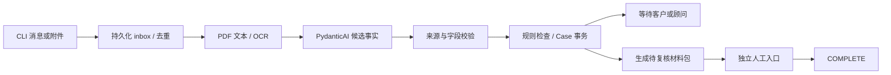

# 实现与调试

入口是 `VisaService.handle_event(CaseEvent) -> TurnResult`。没有通用工作流引擎。一次调用处理一次外部事件，返回后停止；下一条消息或定时事件继续案件。



## 一条消息如何落库

1. `documents.stage_file()` 检查类型、大小，计算 SHA-256，把字节保存到 `data/files/`。数据库只记录引用。相同字节只保留一份；单文件最多 10 MB、PDF 最多 20 页、图片最多 2500 万像素、每事件最多五个附件。
2. `service.handle_event()` 第一个事务写入 inbox。唯一键是 `(case_id,event_id)`。输入内容哈希不包含普通事件的接收时间，便于渠道重投。新业务输入先递增版本、清除审批并标记待处理；因此中途退出也不能继续沿用旧审批。
3. 第二个写事务重新检查事件状态，读取当前 Case，处理新增文件、调用模型、校验候选值、执行 `rules.evaluate()`。成功后一次提交 Case、事件回复和 trace。
4. 抛异常时第二个事务回滚。独立错误事务记录失败，把案件置于 `NEEDS_HUMAN`；原始 inbox 仍可重试。文件写入不在 SQLite 事务内，可能留下未引用的文件/ZIP；它们不会成为已批准结果。

`Store.transaction()` 使用 `BEGIN IMMEDIATE`。当前选择一个 SQLite writer，包括模型期间的锁，以换取直接可读的串行语义。吞吐量限于本地 CLI；服务化时先改为持久任务和按案租约。

## 文档与字段

`documents.read_document()` 对每页先用 pypdf 提取文字。文字过少/出现损坏字符时，用 PDFium 渲染，再交给 RapidOCR。图片直接 OCR。OCR 最低行置信度低于 0.8 时，该文件不能直接作为通过检查的证据。阈值来自当前演示设置，未做真实证件校准。

`Proposal` 只包含材料分类和候选事实。事实形状示例：

```json
{
  "key": "bank_minimum",
  "value": "40000",
  "source_id": "<file hash prefix>",
  "page": 1,
  "quote": "bank_minimum: 40000",
  "confidence": "high"
}
```

`evidence.apply_proposal()` 校验来源属于案件、页码存在、原文摘录可定位、字段在有限词表中，随后校验金额、日期或值与摘录的关系。金额用 `Decimal` 比较，日期解析为 `date`；持久化为规范字符串以便 JSON 审计。两份不一致事实同时保留。客户自述的来源是 `message:<event_id>`，不能满足要求文件证据的检查。

`Evidence` 忽略被拒绝文件、读取有问题的文件和未确认低置信度字段。多个不同值会返回未知。模型不能静默选择冲突中的一个。顾问 `confirm_fact` 明确选择一个值，旧值仍在历史内。

来源校验验证可定位性和有限格式/值约束，不能证明模型对任意自然语言语义的理解正确，也不能认证文件真实性。分类、姓名归属、资金来源及完整页码需最终复核。扫描件裁掉未见内容时，程序只能发现缺少所需字段，不能保证识别所有缺页。

## 每轮模型内容与停止

`agent.build_context()` 拼接职责、字段词表、带版本 SOP、当前事实、阻塞项、新消息、文件摘录、最近六轮对话。默认工作内容上限 12,000 字符，先减少文件摘录，再去掉旧对话；关键内容仍超限则停止。完整历史不会因此删除。该值限制应用装配的业务内容，并不等同于供应商最终序列化请求的 token 上限；工具 schema 等额外开销由实际 token 记录呈现。

唯一业务工具 `read_evidence(document_id,page)` 只能读本案已保存材料，受剩余字符预算约束。重复读取同页直接停止。权限独立于材料中的文字，任何“忽略规则/批准案件”内容都无法增加批准工具。

PydanticAI 提供 `Proposal` 的结构校验与工具调用。每事件最多四次请求，结构重试、工具循环、网络重试共用 HTTP 计数；仅瞬时错误允许额外尝试一次，供应商 SDK 自带重试关闭。全批 60 次请求在单独 SQLite ledger 预留，进程重启后仍有效。不可达的请求也保守占用一次。

客户回复由 `rules.reply_for()` 根据当前状态与前三个优先阻塞项生成，避免模型自行宣布交付。该版本主要验证事实提取及持续补件，不提供开放式签证咨询。等待期间没有后台模型轮询。`tick` 每隔至少 24 小时提醒一次，最多两次，之后仍等待并提示顾问跟进。

## 规则是什么，哪些交给人

`rules.evaluate()` 为每项输出 `pass/fail/unknown/not_applicable`、来源 URL、有关事实 ID、是否需专业复核。路线条件采用适用、不适用、未知三种情况。规则源码 SHA-256 参与 `RULE_VERSION`，没有运行时联网更改政策。

| 范围 | 自动检查 | 顾问边界 |
|---|---|---|
| 共通 | 成年/境外/家属及拒签分支，证件字段和日期，姓名冲突，翻译声明元数据 | 文件真实性、翻译资质、复杂身份及未覆盖分支 |
| Visitor | 访问日期、用途信息、回国联系、预算与文件资金对照，在职支持 | 访问可信性、资金来源和充分性；工作证明是此演示分支的支持项，并非所有访客法定必交文件 |
| Student | CAS 信息、学费与最多九个月生活费、28 天/31 天、差异化材料分支、条件 TB/ATAS | CAS/课程有效性、其他资助形式、未覆盖豁免、真实性 |
| Skilled Worker | CoS 信息、维持费用承诺切换、GBP 1270 的 28 天/31 天、英语 B2 信息、条件 TB | 雇主资质、职业/薪资资格、英语证明认可性、其他申请路径 |

Student 月生活费冻结为伦敦 GBP 1529、伦敦外 GBP 1171（官方核对日期 2026-10-05 UTC）。差异化分支只决定是否提交证明，不取消实际资金条件；若已提供银行材料，也检查其明显问题。非 GBP 自动换算没有实现，明确转顾问。

资金证明支持银行流水或银行信替代，但一份证据必须提供银行、持有人、币种、最低余额、起止日期。不能用缺字段的替代文件放行，也不能拼几份残缺文件伪装成一份完整证明。当前检查显式最低余额和日期，尚未对任意银行逐笔交易做余额重算。

国家分支仅覆盖源码中列出的少量国家；TB 历史只自动处理已覆盖国家的连续居住条件。Skilled Worker 的自动职业分支只有 2134。未实现的情况进入人工状态，人工无法直接跳过业务阻塞批准：需补充材料、确认事实，或在实现新的规则分支后重新检查。

CAS/CoS 必须有可核对的学校/雇主来源信息，不要求所谓“官方 CAS/CoS PDF 原件”。CLI 当前承载形式是 PDF/图片，后续渠道可把受信任的学校/雇主消息接成证据；普通申请人自述目前不能替代文件来源。

## 人工入口与交付

`review_case(case_id,expected_version,decision,notes)` 是独立应用方法，不在模型工具表。批准前检查当前版本、规则版本、未处理事件、阻塞项和 ZIP 内容。审批绑定版本与 `manifest()` 的哈希。新输入或规则变化会使旧审批失效。

`delivery.build_pack()` 校验原始文件哈希，生成原件目录、HTML 报告、JSON 清单、审批记录和 ZIP。`verify_pack()` 在批准前复查 ZIP 中的清单、证据字节及文件集合。报告可按“原文 → 事实 → 检查 → 状态”核对。审批表示当前材料准备版本经顾问确认，不表示 UKVI 批准。

本地 CLI 以操作系统用户作为信任边界，`reviewer` 是审计标签；尚无用户认证。不要把这个入口直接作为未经授权的公共 API 暴露。

## 哪里查问题

| 症状 | 命令/函数 | 看什么 |
|---|---|---|
| 图片/扫描 PDF 提取不对 | `visa-agent read FILE` / `documents.image_text()` | 页文字、OCR 置信度和 problems |
| 字段被拒绝 | `visa-agent trace CASE` / `apply_proposal()` | proposal、rejected_candidates、原文页 |
| 一直补件 | `visa-agent inspect CASE` / `evaluate()` | checks 中 fail/unknown 的 ID 和来源 |
| 模型停住 | `trace` / `extract()` | tools、错误、HTTP 请求数、context_chars、耗时 |
| 重启后未完成 | `events` / `handle_event()` | pending/failed；用相同事件重试或顾问 dismiss |
| 旧审批失效 | `inspect` / `review_case()` | version、rule_version、approval、pending_error |

每个事件有 `run_id`，trace 保存输入、读取结果、候选提取、工具输出、Case 前后快照、命中规则、模型和提示词版本、用量。保留可观察结果，不保存模型隐藏推理。API 密钥不会主动写入日志。

## 为什么选择这些组件

PydanticAI 只承担模型适配、类型输出和工具限制；SQLite 提供事务与唯一约束；PDF/OCR 使用已有库。复用 Camunda KYC 的异步补件流程、DocProof 的提取/确定性检查分离、LangChain 邮件例子的 HITL/评测思路，未复制其运行时代码或引入 Camunda/LangGraph/Chatwoot 服务。Chatwoot 留作后续渠道层；运行时无 agent-reach 和 Codex skill 依赖。
