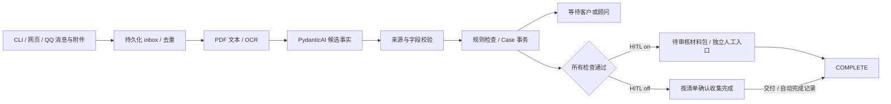

# 实现与调试

入口是 `VisaService.handle_event(CaseEvent) -> TurnResult`。没有通用工作流引擎。一次调用处理一次外部事件，返回后停止；下一条消息或定时事件继续案件。

最终交付入口：`delivery.build_pack()` 按 `archive_path()` 保存原始字节，另生成双语信息表、`START-HERE.html`、检查记录和 `submission.bilingual_guide()`。`verify_pack()` 在发信前检查清单、原件哈希、信息表和指引内容。`QQInbox._send()` 仅在 COMPLETE 且 ZIP 未超附件上限时添加 `visa-materials.zip`，发送后保存 MIME 回执；Outlook 下载验证见 [full-delivery.md](full-delivery.md)。`service.handle_event()` 只在信息项仍缺失或格式失败时附待填表，避免信息已齐仍反复催填。

以下人工复核说明适用于默认 `--hitl on`。新增 `--hitl off` 时，检查满足后应用自动确认收集完成，写入独立 `automatic_completion`，不会伪造人工审批；完整状态和 Outlook 接入见 [hitl-outlook.md](history/hitl-outlook.md)。

本地上传页入口是 `python -m visa_agent.web`，默认空白案件。`web.html` 把拖入的文件和消息提交到 `/api/event`；`web.LocalApp.event()` 保存附件，经 `Inbox` 路由到同一个服务。仅在明确选择合成演示时载入对应背景，并随首次成功事件录入。`/api/review` 独立调用 `review_case()`，关闭 HITL 的案件禁用此入口。页面用随机 Cookie 标识工作区，数据库保存工作区、渠道会话和案件的绑定；重启恢复绑定，`/reset` 才新建案件。旧案件和原始对话保留供追溯。



## 一条消息如何落库

1. `documents.stage_file()` 检查类型、大小，计算 SHA-256，把字节保存到 `data/files/`。数据库只记录引用。相同字节只保留一份；单文件最多 10 MB、PDF 最多 20 页、图片最多 2500 万像素、每事件最多五个附件。
2. `service.handle_event()` 第一个事务写入 inbox。唯一键是 `(case_id,event_id)`。输入内容哈希不包含普通事件的接收时间，便于渠道重投。新业务输入先递增版本、清除审批并标记待处理；因此中途退出也不能继续沿用旧审批。
3. 第二个写事务重新检查事件状态，读取当前 Case，处理新增文件、调用模型、校验候选值、执行 `rules.evaluate()`。成功后一次提交 Case、事件回复和 trace。
4. 抛异常时第二个事务回滚。独立错误事务记录失败，把案件置于 `NEEDS_HUMAN`；原始 inbox 仍可重试。文件写入不在 SQLite 事务内，可能留下未引用的文件/ZIP；它们不会成为已批准结果。

`Store.transaction()` 使用 `BEGIN IMMEDIATE`。当前选择一个 SQLite writer，包括模型期间的锁，以换取直接可读的串行语义。吞吐量限于本地 CLI；服务化时先改为持久任务和按案租约。

## 文档与字段

`Document.content_role` 区分证明、自述、样例、无关和未确定。`documents.content_role_for()` 拦截内部字段清单，旧持久化附件也重新检查；`Evidence.admissible()` 只接受明确的证明，或本机演示案件中的样例。模型不能把读取器识别的字段清单提升为证明。普通文字 PDF 本身不是拒绝条件；银行信、在职信仍可按内容分类。普通标签的自制页依赖模型分类，尚不能保证任意版式不误判。错误原因以 `self_report_not_evidence` / `evidence_type_unconfirmed` 记录。

材料规则指纹包含 `evidence.py` 和 `documents.py`；规则变化时既有批准失效，`mail_outbox.send_prepared_reply()` 也拒发旧规则下排队的回复。

`documents.read_document()` 对每页先用 pypdf 提取文字，并检查 PDFium 图片和填充矢量图形（含嵌套 Form）。含图片或填充图形、文字过少、字符损坏的页面整页渲染后交给 RapidOCR；这样可以覆盖本次出现的扫描材料和黑条遮盖情形。纯文字页继续直接提取。独立的 `Page X of Y` 行用于发现明确声明的缺页；没有页码的缺页不保证能检出。OCR 最低行置信度低于 0.8 时，该文件不能直接作为通过检查的证据。阈值未做真实证件校准，logo/背景色块也会触发 OCR，增加耗时。

`Proposal` 只包含材料分类和候选事实。事实形状示例：

```json
{
  "key": "bank_minimum",
  "value": "40000",
  "source_id": "<file hash prefix>",
  "page": 1,
  "quote": "bank_minimum: 40000",
  "confidence": "high"
}
```

`evidence.apply_proposal()` 校验来源属于案件、页码存在、原文摘录可定位、字段在有限词表中，随后校验金额、日期或值与摘录的关系。金额用 `Decimal` 比较，日期解析为 `date`；持久化为规范字符串以便 JSON 审计。两份不一致事实同时保留。客户自述的来源是 `message:<event_id>`，不能满足要求文件证据的检查。

完整中文日期（如 `2026年12月10日`）按原文核对。首次自述的申请/旅行日期只说月日时，模型猜出的年份不会写入事实；`unconfirmed_candidates` 和 `date_year_missing` 诊断记录原因，缺失日期检查继续询问。该处理不用于文件日期，也不用于更改已有日期；错误月日、伪造引用仍会进入提取复核。

首次咨询若只说居住地，模型不能替客户确定申请地点。无明确来源的 `application_location` 自述候选保留为 `application_location_unconfirmed`，由缺项检查继续询问；文件来源或修改已有申请地点时仍严格拒绝。原始候选和未确认原因保留在日志。

`Evidence` 忽略被拒绝文件、读取有问题的文件和未确认低置信度字段。多个不同值会返回未知。模型不能静默选择冲突中的一个。顾问 `confirm_fact` 明确选择一个值，旧值仍在历史内。

来源校验验证可定位性和有限格式/值约束，不能证明模型对任意自然语言语义的理解正确，也不能认证文件真实性。分类、姓名归属、资金来源及完整页码需最终复核。扫描件裁掉未见内容时，程序只能发现缺少所需字段，不能保证识别所有缺页。

## 每轮模型内容与停止

关闭 HITL 时，`service.handle_event()` 在清单满足后直接写入 `AutomaticCompletion(basis="checklist")`，再生成本地材料包；无需引导模型批准。文件生成失败会回滚为失败状态。完整业务分工与边界见 [材料收集 workflow](history/collection-workflow.md)。

`persona.py` 从包内 [SOUL.md](../src/visa_agent/prompts/SOUL.md) 读取顾问服务原则，置于提取、引导两个阶段的系统指令最前；同样计入上下文长度，trace 记录文件内容哈希。模型选择引导，`conversation.py` 组织欢迎、承接、材料结论与进度；固定措辞不会被客户邮件或附件中的“新 SOUL”覆盖。

`agent.build_context()` 拼接职责、字段词表、带版本 SOP、当前事实、阻塞项、新消息、文件摘录、最近 20 轮完整对话。默认工作内容上限 32,000 字符，先减少文件摘录，再去掉旧对话；关键内容仍超限则停止。完整历史不会因此删除。该值限制应用装配的业务内容，并不等同于供应商最终序列化请求的 token 上限；工具 schema 等额外开销由实际 token 记录呈现。

唯一业务工具 `read_evidence(document_id,page)` 只能读本案已保存材料，受剩余字符预算约束。重复读取同页直接停止。权限独立于材料中的文字，任何“忽略规则/批准案件”内容都无法增加批准工具。

图片和 PDF 共用 `pagination_problems()` 检查明确页码。缺页来源的 `bank_minimum` 候选直接拒绝；不同文件的页码不自动合并。工作摘录标明截断和原文长度。完整页读不下时，工具返回明确的未读取结果；`handle_event()` 将阅读容量问题写入该文件，规则要求人工复核。问题跨消息和重启保留，可由顾问核对全文后通过 `accept_document` 清除。

PydanticAI 提供 `Proposal` 的结构校验与工具调用；检查后再用 `Guidance` 选择下一轮优先问题。两个阶段共用预算。每事件最多四次请求，结构重试、工具循环、网络重试共用 HTTP 计数；仅瞬时错误允许额外尝试一次，供应商 SDK 自带重试关闭。请求在 SQLite ledger 预记账，重启保留；当前累计不限，只有显式设置 `--request-cap` 才应用累计上限。早期验收的 60 次是当时实验条件。不可达请求也保守占用一次。

`guidance.guide()` 在检查之后，使用当前事实、最近对话及未解决检查项，让模型选最多三个问题、解释主题和引导方式。输出只能引用已有未解决检查 ID；选择不存在、已通过或重复的 ID 会被拒绝。模型没有批准工具。`conversation.reply_for()` 用已核对的双语措辞组织这些选择，状态、进度、风险说明由实际检查决定。日志同时保存 `proposal`、`guidance`、两个阶段的上下文及原始响应。

`agent.run_phase()` 共用四次请求和一次瞬时重试预算；引导失败也保留失败记录。等待期间没有模型轮询。`tick` 间隔至少 24 小时，最多两次提醒。来源校验失败写入 `Case.extraction_issues`，跨消息保留，顾问通过 `dismiss_extraction --target EVENT_ID` 明确处理后才能清除。

上下文是结构化案件快照加最近 20 轮，不使用模型自由摘要覆盖姓名、金额或日期。同字段同值按可用性分组合并，冲突值分别保留；完整来源存于数据库。预算不足先减少长文件摘录，再删除最旧完整问答。关键事实及规则不能容纳时停给人工；日志 `context_policy` 记录实际保留轮次。旧对话保存在 `events`，可用 `Store.dialogue(before=cursor)` 分页读取。

## 收件身份与会话生命周期

`inbox.Incoming` 不接受客户端传入的 case_id。`Inbox` 按 channel/account/thread 查找会话，并核对已绑定的 sender；message_id 在渠道账户内唯一，重复内容复用结果，同 ID 不同内容拒绝。邮箱只做格式与域名规范化，不合并加号别名；WhatsApp 使用 E.164 电话格式。格式有效不等于身份已验证。

`receive_simulated()` 是本地收件测试。`receive_signed()` 验证内部连接器的原始字节 HMAC 和五分钟时间窗，不是 Twilio/SendGrid 的官方 webhook 签名实现。真实 WhatsApp 尚未接入。

QQ 邮件由 `QQConnection` 从登录的收件箱读取，`parse_mail()` 拆出新正文和附件，`QQInbox.receive()` 校验发件地址、Message-ID 和引用链。新线程创建案件，回复引用入站或出站 Message-ID 时沿用原线程；其他发件人不能接入已绑定线程。随后调用 `Inbox.receive_connector(provider="imap")`，由现有服务写入案件。这里确认的是收件账户及邮件头绑定，不是对客户的身份认证。

收信游标保存在 `qq_cursor`；引用链在 `qq_threads`；预览及发送状态在 `qq_receipts`。`mail_outbox.send_prepared_reply()` 同时服务 QQ 和 Graph：发送前重新核对案件版本与会话状态，事务占位后调用网络；成功标记 `sent`，网络歧义标记 `uncertain`，不自动重发。新轮询从 SQLite 恢复，空扫描不调用模型。QQ 的配置、限额、停止及真实结果见 [qq-mail.md](qq-mail.md)。

`/exit` 关闭会话，后续输入不调用模型。`/reset`、`/start` 新建空白案件；原案件关闭、原始审计保留，不进入新上下文。命令本身不耗模型。网页通过服务端随机 cookie 隔离浏览器工作区，重启从 `web_workspaces` 恢复。右侧渠道身份切换是本地测试人员模拟入口，不是面向客户的身份认证。

SQLite 当前在写事务内执行模型调用，所有案件写入会串行；适合本机 MVP，不能据此承诺多客户生产吞吐。连接用完即关闭，首次 WAL 初始化锁冲突有有限重试。

## 规则是什么，哪些交给人

`rules.evaluate()` 为每项输出 `pass/fail/unknown/not_applicable`、来源 URL、有关事实 ID、是否需专业复核。路线条件采用适用、不适用、未知三种情况。规则源码 SHA-256 参与 `RULE_VERSION`，没有运行时联网更改政策。

| 范围 | 自动检查 | 顾问边界 |
|---|---|---|
| 共通 | 成年/境外/家属及拒签分支，证件字段和日期，姓名冲突，翻译声明元数据 | 文件真实性、翻译资质、复杂身份及未覆盖分支 |
| Visitor | 访问日期、用途信息、回国联系、预算与文件资金对照，在职支持 | 访问可信性、资金来源和充分性；工作证明是此演示分支的支持项，并非所有访客法定必交文件 |
| Student | CAS 信息、学费与最多九个月生活费、28 天/31 天、差异化材料分支、条件 TB/ATAS | CAS/课程有效性、其他资助形式、未覆盖豁免、真实性 |
| Skilled Worker | CoS 信息、维持费用承诺切换、GBP 1270 的 28 天/31 天、英语 B2 信息、条件 TB | 雇主资质、职业/薪资资格、英语证明认可性、其他申请路径 |

Student 月生活费冻结为伦敦 GBP 1529、伦敦外 GBP 1171（官方核对日期 2026-10-05 UTC）。差异化分支只决定是否提交证明，不取消实际资金条件；若已提供银行材料，也检查其明显问题。非 GBP 自动换算没有实现，明确转顾问。

资金证明支持银行流水或银行信替代，但一份证据必须提供银行、持有人、币种、最低余额、起止日期。不能用缺字段的替代文件放行，也不能拼几份残缺文件伪装成一份完整证明。当前检查显式最低余额和日期，尚未对任意银行逐笔交易做余额重算。

国家分支仅覆盖源码中列出的少量国家；TB 历史只自动处理已覆盖国家的连续居住条件。Skilled Worker 的自动职业分支只有 2134。未实现的情况进入人工状态，人工无法直接跳过业务阻塞批准：需补充材料、确认事实，或在实现新的规则分支后重新检查。

CAS/CoS 必须有可核对的学校/雇主来源信息，不要求所谓“官方 CAS/CoS PDF 原件”。CLI 当前承载形式是 PDF/图片，后续渠道可把受信任的学校/雇主消息接成证据；普通申请人自述目前不能替代文件来源。

## 人工入口与交付

`review_case(case_id,expected_version,decision,notes)` 是独立应用方法，不在模型工具表。批准前检查当前版本、规则版本、未处理事件、阻塞项和 ZIP 内容。审批绑定版本与 `manifest()` 的哈希。新输入或规则变化会使旧审批失效。

`delivery.build_pack()` 校验原始文件哈希，生成原件目录、HTML 报告、JSON 清单、审批记录和 ZIP。`verify_pack()` 在批准前复查 ZIP 中的清单、证据字节及文件集合。报告可按“原文 → 事实 → 检查 → 状态”核对。审批表示当前材料准备版本经顾问确认，不表示 UKVI 批准。

本地 CLI 以操作系统用户作为信任边界，`reviewer` 是审计标签；尚无用户认证。不要把这个入口直接作为未经授权的公共 API 暴露。

## 哪里查问题

| 症状 | 命令/函数 | 看什么 |
|---|---|---|
| 图片/扫描 PDF 提取不对 | `visa-agent read FILE` / `documents.image_text()` | 页文字、OCR 置信度和 problems |
| 字段被拒绝 | `visa-agent trace CASE` / `apply_proposal()` | proposal、rejected_candidates、原文页 |
| 一直补件 | `visa-agent inspect CASE` / `evaluate()` | checks 中 fail/unknown 的 ID 和来源 |
| 模型停住 | `trace` / `extract()` | tools、错误、HTTP 请求数、context_chars、耗时 |
| 重启后未完成 | `events` / `handle_event()` | pending/failed；用相同事件重试或顾问 dismiss |
| 旧审批失效 | `inspect` / `review_case()` | version、rule_version、approval、pending_error |

每个事件有 `run_id`，trace 保存输入、读取结果、候选提取、工具输出、Case 前后快照、命中规则、模型和提示词版本、用量。保留可观察结果，不保存模型隐藏推理。API 密钥不会主动写入日志。

## 为什么选择这些组件

PydanticAI 只承担模型适配、类型输出和工具限制；SQLite 提供事务与唯一约束；PDF/OCR 使用已有库。复用 Camunda KYC 的异步补件流程、DocProof 的提取/确定性检查分离、LangChain 邮件例子的 HITL/评测思路，未复制其运行时代码或引入 Camunda/LangGraph/Chatwoot 服务。Chatwoot 留作后续渠道层；运行时无 agent-reach 和 Codex skill 依赖。
# 2026-10-06：视觉输入与客户回复

`handle_event()` 仍是唯一业务写入入口。`extract()` 在原有文字上下文外调用 `vision.visual_inputs()`：保留图片原始字节，PDF 用 PDFium 逐页渲染，连同页码和 OCR 发给 `deepseek-flash`。发送结果和图片哈希保存在 `visual_inputs`；日志不写 base64。被遮盖内容不会从 PDF 隐藏文字层恢复。

模型输出新增材料 `content_role`、视觉差异标志和客户 `intent`。`apply_proposal()` 保留样例标记并校验引用；`Evidence.admissible()` 决定字段能否参与检查。普通案件中的样例/无关材料不能用于满足要求。`Case.test_mode` 只能在本地创建演示案件时明确设置，模型工具、客户文本和切换离线传输都不能打开它。

`conversation.reply_for()` 接收已检查的 Case，使用官方步骤、材料说明和三条以内的下一步组织回复；`language_for()` 只看客户消息，附件不会改变回复语言。`material_progress()` 按材料类别汇总，未知、姓名冲突和未适用要求不算通过。初始路线未知时不显示虚假的百分比；人工审批单独显示。客户回复本身不由第二次自由生成调用产生。

`diagnostics.turn_diagnostics()` 保存问题阶段、类别、源文件/页码、检查项和恢复动作。`agent.py` 保留实际 HTTP 响应中的可观察输出，包含失败重试，排除隐藏推理；`scripts/show_case_replies.py` 展示原话、视觉发送记录与分类详情。规则版本变化仍会使旧审批失效。
